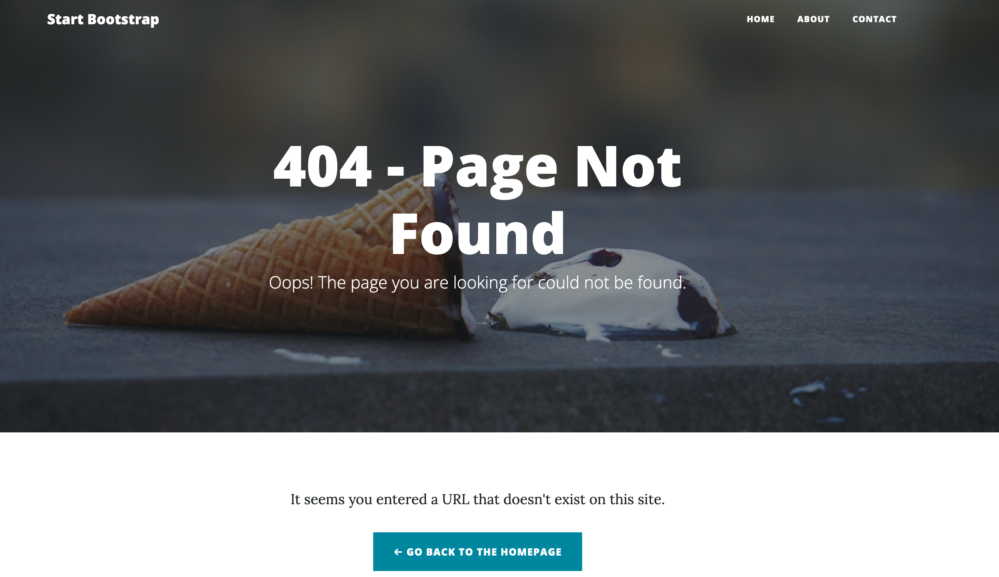

# Template Engines with Nunjucks

This project demonstrates the process of converting a static HTML theme into a dynamic, data-driven website using **Express.js** and the **Nunjucks template engine**. It was developed as a practical exercise for the **Advanced Web Development** course at **Spiced Academy (AWD25)**.

The core challenge was to take the static "Clean Blog" theme and "re-package" it into a modular and maintainable structure. This involved breaking down the original HTML into reusable components (layouts, partials, and macros) and dynamically generating the blog posts from a central JSON data source.

## Key Concepts Demonstrated

- **Server-Side Rendering (SSR):** Using Express to render HTML on the server.
- **Template Inheritance:** Creating a master page to maintain a consistent look and feel across all pages.
- **Reusable Components with Macros:** Building modular UI components (like page headers and form inputs) to follow the DRY principle.
- **Dynamic Routing:** Creating routes in Express to serve individual blog posts based on a URL slug.
- **Data-Driven Content:** Reading from a local JSON file to populate the site's content dynamically.

## Tech Stack

- **Backend:** Node.js, Express.js, TypeScript
- **Template Engine:** Nunjucks
- **Frontend:** HTML, CSS (Bootstrap), Vanilla JS
